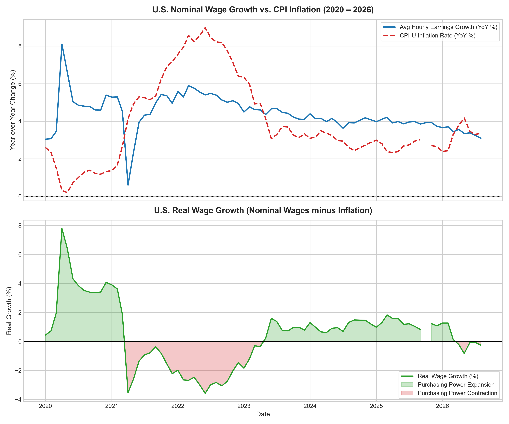

# U.S. Wage Growth vs. Inflation Pipeline: Analyzing Real Purchasing Power (2020–2026)

An end-to-end macroeconomic data engineering and analytics pipeline. This project ingests Consumer Price Index (CPI-U) and Average Hourly Earnings data from the Bureau of Labor Statistics (BLS) API v2, implements an idempotent relational staging and modeling layer in SQLite, computes exact 12-month calendar-lookback metrics in SQL, and generates analytical visualizations alongside clean data exports for Tableau Public.

---

## Architecture & Data Flow

```
┌─────────────────┐      HTTP POST       ┌────────────────────────┐
│  BLS Public API ├─────────────────────►│  Python Ingestion ETL  │
│  v2 Endpoint    │   (Requests/JSON)    │  (Date Normalization)  │
└─────────────────┘                      └───────────┬────────────┘
                                                     │
                                                     ▼
┌─────────────────────────┐     SQL CTEs       ┌────────────────────────┐
│ Analytical Fact Table   │◄───────────────────┤ SQLite Staging Layer   │
│ fct_economic_indicators │ (Calendar Self-Join│ stg_bls_monthly        │
└───────────┬─────────────┘   YoY Lookbacks)   └────────────────────────┘
            │
            ├──────────────────────────┬─────────────────────────┐
            ▼                          ▼                         ▼
   ┌───────────────────┐      ┌───────────────────┐    ┌────────────────────┐
   │ SQLite Fact Layer │      │   Tableau Export  │    │ Matplotlib Trends  │
   │  bls_analytics.db │      │    (CSV Extract)  │    │   (Figure Export)  │
   └───────────────────┘      └───────────────────┘    └────────────────────┘
```

---

## Economic Indicator Methodology

* **Headline CPI-U (`CUSR0000SA0`):** Consumer Price Index for All Urban Consumers (representing ~93% of the U.S. population).
* **Average Hourly Earnings (`CES0500000003`):** Total Private, Non-Farm Average Hourly Earnings ($/hour).
* **Year-over-Year (YoY) Percentage Change:**
  $$\text{YoY Growth Rate (\%)} = \left( \frac{\text{Value}_{\text{current}} - \text{Value}_{\text{prior year}}}{\text{Value}_{\text{prior year}}} \right) \times 100$$
* **Real Wage Growth (Net Purchasing Power):**
  $$\text{Real Wage Growth (\%)} = \text{Nominal Wage Growth (\%)} - \text{CPI Inflation (\%)}$$

### Handling Missing Periods & Audit Integrity
Unlike standard fixed-offset lookbacks (`LAG(12)`), this pipeline joins current monthly observations against exact calendar dates derived via SQLite's `date(date_str, '-1 year')`. During historical federal funding lapses (such as the uncollected October 2025 CPI survey), non-existent periods evaluate strictly to `NULL` rather than artificial forward-fills, preventing synthetic zero-inflation artifacts from distorting subsequent annualized spreads.

---

## Visualizations & Macroeconomic Findings



1. **2020 Pandemic Dislocation (Composition Effect):** Nominal Average Hourly Earnings spiked to an annualized **+8.10%** in April 2020. This surge was primarily driven by labor force composition shifts: mass service-sector layoffs disproportionately removed lower-wage earners from the active sample, artificially inflating aggregate hourly averages.
2. **2021–2022 Inflation Surge (Purchasing Power Contraction):** CPI-U accelerated rapidly to peak near **9.0%** in mid-2022 due to pandemic supply constraints and energy shocks. Despite nominal wage gains of 4.5%–5.5%, Real Wage Growth plummeted to **-3.5%**, eroding consumer purchasing power for nearly two consecutive years.
3. **2023–2025 Disinflation & Real Expansion:** As headline inflation cooled toward 2.4%–3.0% and nominal wage growth stabilized at 3.6%–4.0%, real purchasing power returned to positive territory (**+0.8% to +1.3%**).
4. **Mid-to-Late 2026 Reacceleration:** Headline CPI-U ticked back up to **3.35%** by August 2026, outpacing shelter disinflation (~3.0%) due to commodity/energy rebounds and persistent non-shelter service inflation, compressing the real wage growth spread back into slightly negative territory (**-0.26%**).

---

## Repository Structure

```text
bls-wage-inflation-pipeline/
├── .gitignore                      <- Python, IDE, and environment cache exclusions
├── README.md                       <- Project documentation and findings
├── requirements.txt                <- Dependency management
├── data/
│   ├── bls_analytics.db            <- SQLite relational staging & fact layers
│   └── bls_real_wage_analysis.csv  <- Production export for Tableau Public
├── figures/
│   └── real_wage_growth_trends.png <- High-resolution trend plots
├── notebooks/
│   └── PJ001_BLS_Analysis.ipynb  <- Documented research and development notebook
└── src/
    └── pipeline.py                 <- Modular, production-ready ETL script
```

---

## Quickstart

### 1. Environment Setup
```bash
git clone [https://github.com/gpallekonda/bls-wage-inflation-pipeline.git](https://github.com/gpallekonda/bls-wage-inflation-pipeline.git)
cd bls-wage-inflation-pipeline
pip install -r requirements.txt
```

### 2. Run Autonomous Pipeline
```bash
python src/pipeline.py
```